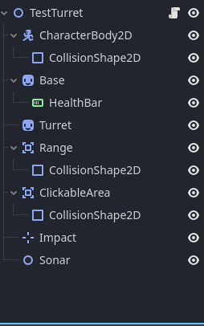
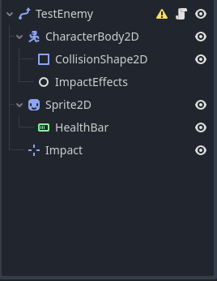
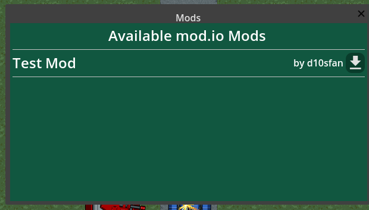

# Duel Defense Mod Example

This repo shows an example for how to mod the game. This is a Godot project that you can load standalone. This godot project can be exported as a .pck file and then put into the mod folder (see tha game repo).

## Creating a Mod

Creating a new Godot project can be used to start from scratch, or this project can be used as a basis. To create a new project, follow the Initial Project Setup.

### Initial Project Setup

#### Godot Project Setup

First, after the Godot project has been created, go into Display/Window and set the viewport size to 1920x1080. The game is designed around this resolution, and then during gameplay, the game is scaled accordingly for smaller screen sizes. When creating a map, this will help make sure it's filled in as expected.

Next, create a folder structure like the following.

```
|-- project.godot
|-- mod-example
    |-- Assets
    |   |-- AssetLicenses
    |   |-- Configs
    |   |   |-- maps.json
    |   |   |-- metadata.json
    |-- Scenes
        |-- Maps
```

The mod-example folder name should be replaced by your mod name, such as mod-space. Then create empty maps.json and metadata.json files in the folders shown. Make sure that the exported .pck file matches the name given here, so that if the mod is called mod-example, then the pck should be mod-example.pck.

The top-level Assets folder that the game has should not be created, unless you are planning on modifying existing assets.

#### Metadata JSON

metadata.json describes the mod, giving a friendly name and an author. An example of this is below:

```json
{
	"name": "Example Mod",
	"author": "d10sfan"
}
```

#### Maps JSON

maps.json describes any maps that have been added in the mod. See mod-example/Assets/Configs/maps.json for an example.


### Creating a Map

To create a map, first create a scene file in the Maps directory that was created above. The nodes should end up looking like the following. Any custom assets can be put in the project as well.


* Ground should be a TileMap with a TileSet including two layers, first one for the ground and second one for the road.
* TowerExclusion should be another TileMap with a TileSet with one layer. Make sure to set the tile size to the same as the Ground.
* Path3D is a Path2D node. Create a Curve2D with points, to the beginning and end of the road.
* BasePlaceholder is a Node2D, and is where the player's base should be placed. This should be at the end of the road.
* EnemyBasePlaceholder is a Node2D, and is where the enemy's base should be placed. This should be at the beginning of the road.
* Turrets is a Node2D, and is used by the game as a container for all turrets placed by the player.

Once all of these nodes have been created and the Ground TileMap layers have been filled in, the map should be complete. Make sure to create an entry in the maps.json, with the waves wanted and other information filled in.


#### Testing the Map

The project can be run standalone, which will mainly just ensure that the map looks reasonable when played, but the game logic will not be loaded.

To try it in the game, export the project as a .pck file, then copy it to the mods folder. Once it is there, launch the game, and the mod map will then show up in the level selection list.


### Creating a Turret

To create a turret, first create a scene file in Scenes/Turrets, creating the directory if it does not already exist. The nodes should end up looking like the following. Any custom assets can be put in the project as well. Abilities could also be created in a similar manner.



* CharacterBody2D should contain a CollisionShape2D.
* Base is a Sprite2D, with the sprite of the turret base.
* Base/HealthBar is a ProgressBar or TextureProgressBar, with 0 to 100 and a step of 1. This should go above the turret and should be defaulted to invisible. This is used to show an impact for maps where the turrets can be hit.
* Turret is a Sprite2D or AnimatedSprite2D.
    * Make sure that the Sprite is facing to the right.
    * Make sure that if the turret is a Sprite2D to provide an AnimationPlayer node, otherwise the AnimatedSprite2D will be played.
    * The AnimationPLayer would be used to show a muzzle flash or move the turret back for example. It should contain an animation with the name "Fire".
* Range is a Area2D with a CollisionShape2D, this is a Circle2D that will be filled in with the range using the metadata.
    * Make sure to connect body_entered with _on_Range_body_entered, and body_exited with _on_Range_body_exited.
    * Once you have connected them, delete the default method in the gdscript, so that the Turrets gdscript can handle it.
* ClickableArea is a Rectangle2D colision that covers the visual area of the turret, so that it can be clicked on in gameplay.
    * Make sure to connect input_event with _on_ClickableArea_input_event on the ClickableEvent node.
    * Once you have connected them, delete the default method in the gdscript, so that the Turrets gdscript can handle it.
* Impact is a Marker2D, used to show an impact for maps where the turrets can be hit.
* Sonar can be an empty Node2D.

As well, create a gdscript and attach it to the root node. This should just contain the following. Further extension of the scripting portion is possible, and this could be done by overriding functions in this, or creating a custom class, that follows similar behavior.

```
extends Turrets
```

Once this is complete, create a tower_data.json file in Assets/Configs, if it does not already exist. Then create a tower data object, that looks something like the following:

```json
{
	"GunTestGun": {
		"damage": 30,
		"rof": 0.2,
		"range": 400,
		"category": "Projectile",
		"cost": 150,
		"build_anywhere": false,
		"upgrades": ["ActionSell", "ActionRepair"],
		"sound": true,
		"in_build_menu": true,
		"scene_name": "TestTurret",
		"hp": 200
	}
}
```

Once all this is done, the mod can be exported and if a new game is started, the new turret should show in the build menu.

### Creating an Enemy

To create an enemy, first create a scene file in Scenes/Enemies, creating the directory if it does not already exist. The nodes should end up looking like the following. Any custom assets can be put in the project as well.



* The root is a PathFollow2D
* CharacterBody2D/CollisionShape2D is a rectangle covering the sprite of the enemy.
* CharacterBody2D/ImpactEffects is an empty Node2D
* Sprite2D is the sprite of the enemy.
* Sprite2D/HealthBar is a progress bar.
* Impact is a Marker2D.

As well, create a gdscript and attach it to the root node. This should just contain the following. Further extension of the scripting portion is possible, and this could be done by overriding functions in this, or creating a custom class, that follows similar behavior.

```
extends Tank
```

Once this is complete, create a enemy_data.json file in Assets/Configs, if it does not already exist. Then create a enemy data object, that looks something like the following:

```json
{
	"TestTank": {
		"speed": 110,
		"hp": 200,
		"damage": 21,
		"cost": 100,
		"move_sound": "average"
	}
}

```

Next, go into the maps.json and create a enemy in a wave with the base key set to the scene name (without the .tscn), and the category the key you created above.

### Releasing the Mod

Once the mod has been tested, the .pck file can be shared. Mods can be manually installed. As well, mod.io is integrated with the game, so that mods can be downloaded in-game.

Mods cannot be uploaded in-game, but can be uploaded using the web, at https://mod.io/g/duel-defense1. Once a mod has been released, it will then show up in the mods list.


