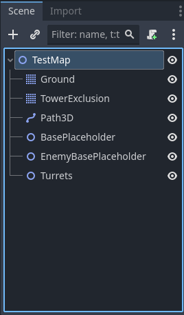
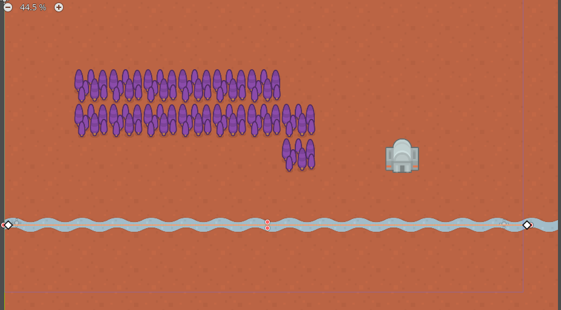
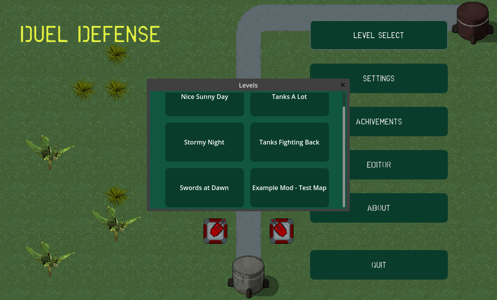
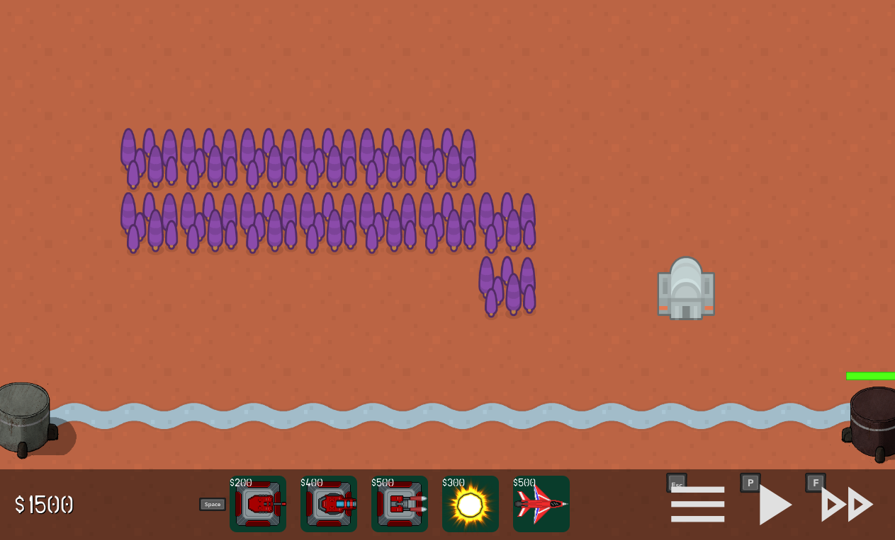

# Duel Defense Mod Example

This repo shows an example for how to mod the game. This is a Godot project that you can load standalone. This godot project can be exported as a .pck file and then put into the mod folder (see tha game repo).

## Creating a Mod

Creating a new Godot project can be used to start from scratch, or this project can be used as a basis. To create a new project, follow the Initial Project Setup.

### Initial Project Setup

#### Godot Project Setup

First, after the Godot project has been created, go into Display/Window and set the viewport size to 1920x1080. The game is designed around this resolution, and then during gameplay, the game is scaled accordingly for smaller screen sizes. When creating a map, this will help make sure it's filled in as expected.

Next, create a folder structure like the following.

|-- project.godot
|-- mod-example
    |-- Assets
    |   |-- AssetLicenses
    |   |-- Configs
    |   |   |-- maps.json
    |   |   |-- metadata.json
    |-- Scenes
        |-- Maps

The mod-example folder name should be replaced by your mod name, such as mod-space. Then create empty maps.json and metadata.json files in the folders shown.

#### Metadata JSON

metadata.json describes the mod, giving a friendly name and an author. An example of this is below:

```json
{
	"name": "Example Mod",
	"author": "d10sfan"
}
```

#### Maps JSON

maps.json describes any maps that have been added in the mod. See mod-example/Assets/Configs/maps.json for an example.


### Creating a Map

To create a map, first create a scene file in the Maps directory that was created above. The nodes should end up looking like the following. Any custom assets can be put in the project as well.



* Ground should be a TileMap with a TileSet including two layers, first one for the ground and second one for the road.
* TowerExclusion should be another TileMap with a TileSet with one layer. Make sure to set the tile size to the same as the Ground.
* Path3D is a Path2D node. Create a Curve2D with points, to the beginning and end of the road.
* BasePlaceholder is a Node2D, and is where the player's base should be placed. This should be at the end of the road.
* EnemyBasePlaceholder is a Node2D, and is where the enemy's base should be placed. This should be at the beginning of the road.
* Turrets is a Node2D, and is used by the game as a container for all turrets placed by the player.

Once all of these nodes have been created and the Ground TileMap layers have been filled in, the map should be complete. Make sure to create an entry in the maps.json, with the waves wanted and other information filled in.



#### Testing the Map

The project can be run standalone, which will mainly just ensure that the map looks reasonable when played, but the game logic will not be loaded.

To try it in the game, export the project as a .pck file, then copy it to the mods folder. Once it is there, launch the game, and the mod map will then show up in the level selection list.





### Creating a Turret

[TODO] Describe and show example of new turret

### Modifying Existing Game Assets

[TODO] Describe and show example of modifying existing game assets, such as a turret sprite

### Releasing the Mod

Once the mod has been tested, the .pck file can be shared.

[TODO] Mod site or mod.io?
